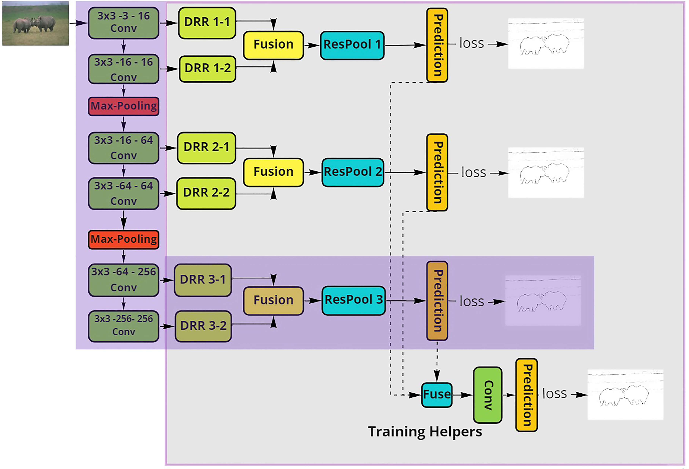

# Fast Inference Network for Edge Detection (FINED)

This repository contains the implementation details of our paper:

"**[FINED: Fast Inference Network for Edge Detection](https://arxiv.org/abs/2012.08392)**"  
by Jan Kristanto Wibisono , Hsueh-Ming Hang   

In this paper, we address the design of lightweight deep learning-based edge detection. The deep learning technology offers a significant improvement on the edge detection accuracy. However, typical neural network designs have very high model complexity, which prevents it from practical usage. In contrast, we propose a Fast Inference Network for Edge Detection (FINED), which is a lightweight neural net dedicated to edge detection. By carefully choosing proper components for edge detection purpose, we can achieve the state-of-the-art accuracy in edge detection while significantly reducing its complexity. Another key contribution in increasing the inferencing speed is introducing the training helper concept. The extra subnetworks (training helper) are employed in training but not used in inferencing. It can further reduce the model complexity and yet maintain the same level of accuracy. Our experiments show that our systems outperform all the current edge detectors at about the same model (parameter) size.

# Architecture 

[TIN](https://ieeexplore.ieee.org/document/9190982) has successfully demonstrated that a lightweight
neural network can have a good performance on image edge
detection. Furthermore, we extend the TIN architecture to
strengthen its detection accuracy. TIN consists of Feature Extractor blocks together with Feature Enrichment and Summarizer operation. We modify the Feature Enrichment module,
and combine it with the Residual Relu operator. We also modify the Summarizer using the Residual Pooling. Then, we
match all the stage outputs to the ground-truth. After extensive study, we found that the multi-stage outputs can serve as
a training helper that guides the training process to produce
a higher performance system. In the inferencing phase, we
remove the training helper to reduce the system complexity.
# Evaluation 

Comparison of complexity and accuracy performance among various edge detection schemes. Our proposed methods (Green). BDCN family (Red). Other methods (Blue). ODS (Transparent label). Number of Parameter (Orange label)


The PR curves of various systems on BSDS500

# FINED-API
Simple API to try FINED. 
* `End Point` : ``` http://lab1.jankristanto.com:8000/image/predict ```
```json 
'Content-Type: multipart/form-data'
{
    'file': binary
}
```

* response :
  ```json
  Response headers content-type: image/png
  ``` 
* Sample response : 

# Citing
Thanks for your interest in our work, please consider citing:

    Link coming soon...    
This paper is accepted to [ICME2021](https://2021.ieeeicme.org/) 
